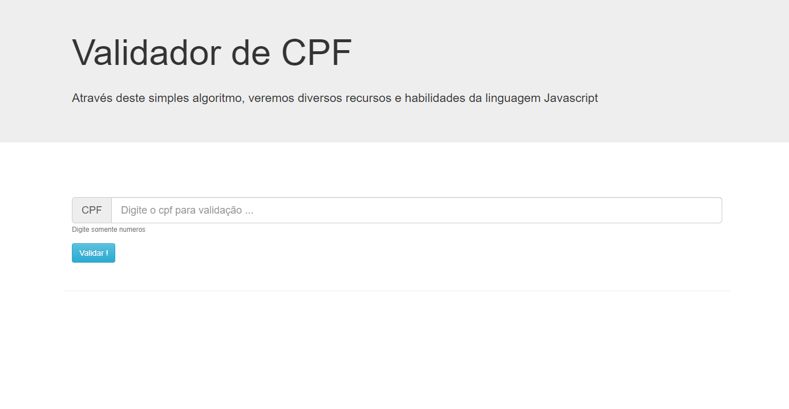

# Validador de CPF | Hiring Coders 3

## 	&#127919; About
Um Validador de CPF, que o valida atráves de algoritimo relacionado ao digito verificador do CPF.

Projeto desenvolvido durante o BootCamp [Hiring Coders 3](https://www.hiringcoders.com.br/).

## &#127775; Features
&#10004; Validar CPF &#10004; JavaScript Vanilla &#10004;BootStrap

### <a href="https://thiagofang.github.io/validador-de-CPF-Hiring-Coders-3/">Clique aqui para visitar o site</a>

